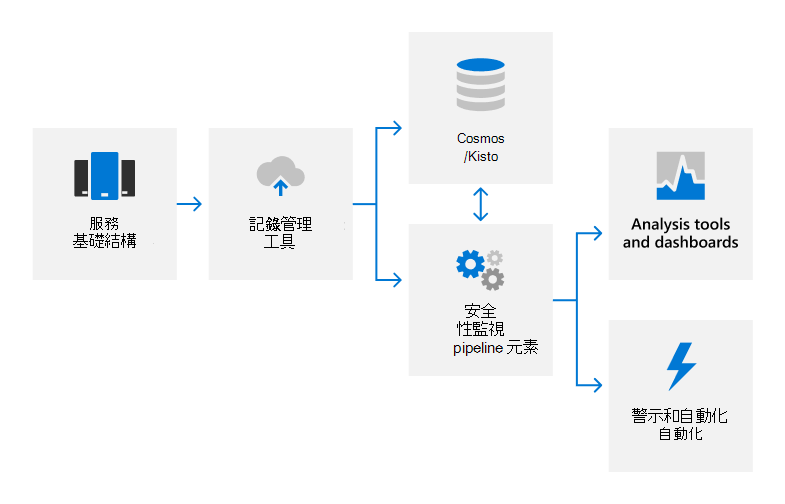

# 稽核記錄概觀

## Microsoft 365 如何使用審核記錄？

Microsoft 365 採用審核記錄來偵測其產品和服務中未授權的活動，並為 Microsoft 人員提供責任。 審核記錄會捕獲系統設定變更和存取事件的詳細資料，並提供詳細資訊來識別誰負責該活動、活動發生的時間和位置，以及活動的結果。 自動化記錄分析可支援接近即時偵測可疑行為。 潛在的事件會呈報給 Microsoft 365 的安全性回應小組，以進一步進行調查。

Microsoft 365 內部審核記錄會從各種來源捕獲記錄資料，例如：

- 事件記錄檔
- AppLocker 記錄
- 效能資料
- System Center 資料
- 詳細通話記錄
- 經驗品質資料
- IIS 網頁伺服器記錄檔
- SQL Server 記錄
- Syslog 資料
- 安全性審核記錄檔

## Microsoft 365 如何集中及報告審計記錄檔？

許多不同類型的記錄資料會從 Microsoft 365 伺服器上傳至專有的安全性監控解決方案，以進行接近即時 (NRT) 分析和內部大型資料計算服務 (Cosmos) 以進行長期存放。 使用 (ODL) 的專屬自動化 Office 工具，在已核准的埠和通訊協定上，使用一種已核准的埠和通訊協定，以 FIPS 140-2 驗證的 TLS 連線進行此資料傳輸。

在 NRT 中使用規則、統計及機器學習方法來處理記錄檔，以偵測系統效能指示器和潛在的安全性事件。 機器教學模型使用儲存在 Cosmos 中的內送記錄資料和歷史記錄資料，以持續改進偵測功能。 安全性相關的偵測會產生警示，向通話工程師通報潛在的事件，並在適用時觸發自動修復動作。 除了自動化的安全性監控之外，服務小組也會流量分析工具及儀表板，進行資料關聯、互動式查詢及資料分析。 這些報告可用於監視及改善服務的整體效能。

如需安全性監視及警示的詳細資訊，請參閱 [安全性監視綜述](assurance-security-monitoring.md)。

## Microsoft 365 如何保護審核記錄？

Microsoft 365 用來收集和處理審計記錄的工具不允許對原始的審計記錄內容或時間順序進行永久或不可逆的變更。 Cosmos 中儲存的 Microsoft 365 資料存取權僅限於授權的人員。 此外，Microsoft 365 會將審核記錄的管理限制為負責進行審計功能的安全小組成員的有限子集。 安全小組不具備 Cosmos 的管理存取權。 系統管理存取需要即時 (JIT) 存取權，而且會記錄及審核 Cosmos 對記錄機制所做的所有變更。 審核記錄會保留足夠長的時間，以支援事件調查並符合法規需求。 Cosmos 中的審計記錄資料保留量的確切期限是由服務小組決定。大部分的審計記錄資料會保留90天或更長的時間。

## Microsoft 365 如何保護可在審計記錄中取得的使用者識別資訊？

在上傳記錄資料之前，ODL 應用程式會使用清理服務來移除任何包含客戶資料的欄位，例如承租人資訊和使用者識別資訊，並以雜湊值取代這些欄位。 匿名和雜湊記錄會重新寫入並上傳至 Cosmos。 所有的記錄傳送都會透過 TLS 加密的連線進行， (FIPS 140-2) 。

## 相關的外部法規 & 認證

Microsoft 的線上服務會定期進行審核，以符合外部法規和認證。 請參閱下表，以驗證與審核記錄相關的控制項。

| **外部審計** | **Section** | **最新報告日期** |
|:--------------------|:------------|:-----------------------|
| [FedRAMP (Office 365) ](https://compliance.microsoft.com/compliancemanager) | AU-2：審核事件   AU-3：審計記錄的內容   AU-4：審計儲存容量   AU-5：對審計處理失敗的回應   AU-6：審核檢查、分析和報告   AU-7：審核減少與報告產生   AU-8：時間戳記   AU-9：保護審計資訊    AU-10：不可否認性   AU-11：審計記錄保留   AU-12：審計產生  | 2020年9月24日 | 
| [ISO 27001/27002 (Office 365) ](https://servicetrust.microsoft.com/ViewPage/MSComplianceGuideV3?command=Download&downloadType=Document&downloadId=8d625374-4f2d-49f8-9d37-a4281ba98222&tab=7027ead0-3d6b-11e9-b9e1-290b1eb4cdeb&docTab=7027ead0-3d6b-11e9-b9e1-290b1eb4cdeb_ISO_Reports)    [適用性聲明](https://servicetrust.microsoft.com/ViewPage/MSComplianceGuideV3?command=Download&downloadType=Document&downloadId=c0df4ce8-c77e-4183-84eb-c8688470d8b1&tab=7027ead0-3d6b-11e9-b9e1-290b1eb4cdeb&docTab=7027ead0-3d6b-11e9-b9e1-290b1eb4cdeb_ISO_Reports)   [認證](https://servicetrust.microsoft.com/ViewPage/MSComplianceGuideV3?command=Download&downloadType=Document&downloadId=1e84a14a-2468-45ac-9412-5e53250d57ec&tab=7027ead0-3d6b-11e9-b9e1-290b1eb4cdeb&docTab=7027ead0-3d6b-11e9-b9e1-290b1eb4cdeb_ISO_Reports) | 12.4：記錄和監控 | 2021 年 4 月 20 日 |
| [ISO 27017 (Office 365) ](https://servicetrust.microsoft.com/ViewPage/MSComplianceGuideV3?command=Download&downloadType=Document&downloadId=8d625374-4f2d-49f8-9d37-a4281ba98222&tab=7027ead0-3d6b-11e9-b9e1-290b1eb4cdeb&docTab=7027ead0-3d6b-11e9-b9e1-290b1eb4cdeb_ISO_Reports)    [適用性聲明](https://servicetrust.microsoft.com/ViewPage/MSComplianceGuideV3?command=Download&downloadType=Document&downloadId=c0df4ce8-c77e-4183-84eb-c8688470d8b1&tab=7027ead0-3d6b-11e9-b9e1-290b1eb4cdeb&docTab=7027ead0-3d6b-11e9-b9e1-290b1eb4cdeb_ISO_Reports)   [認證](https://servicetrust.microsoft.com/ViewPage/MSComplianceGuideV3?command=Download&downloadType=Document&downloadId=70de0999-5451-43a3-9ef4-761e8fbfb1a3&tab=7027ead0-3d6b-11e9-b9e1-290b1eb4cdeb&docTab=7027ead0-3d6b-11e9-b9e1-290b1eb4cdeb_ISO_Reports) | 12.4：記錄和監控 | 2021 年 4 月 20 日 |
| [SOC 1 (Office 365) ](https://servicetrust.microsoft.com/ViewPage/MSComplianceGuideV3?command=Download&downloadType=Document&downloadId=90df3f9c-3aaf-4dbf-99d0-ca9f2991721b&tab=7027ead0-3d6b-11e9-b9e1-290b1eb4cdeb&docTab=7027ead0-3d6b-11e9-b9e1-290b1eb4cdeb_SOC_%2F_SSAE_16_Reports) | CA-48：資料中心記錄   CA-60：審核記錄 | 2020月24日 |
| [SOC 2 (Office 365) ](https://servicetrust.microsoft.com/ViewPage/MSComplianceGuideV3?command=Download&downloadType=Document&downloadId=a73c1738-7892-42b7-acd3-87b6371c53f6&tab=7027ead0-3d6b-11e9-b9e1-290b1eb4cdeb&docTab=7027ead0-3d6b-11e9-b9e1-290b1eb4cdeb_SOC_%2F_SSAE_16_Reports) | CA-48：資料中心記錄   CA-60：審核記錄 | 2020月24日|