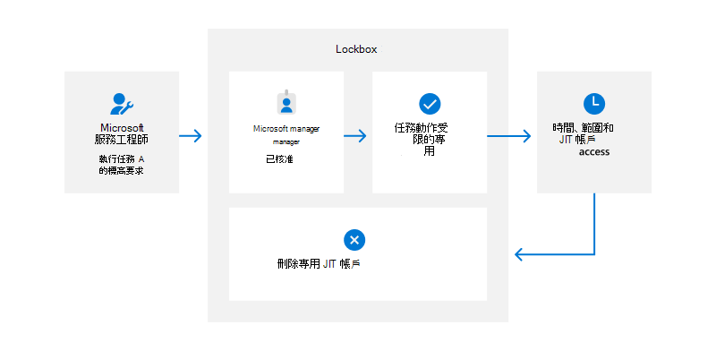
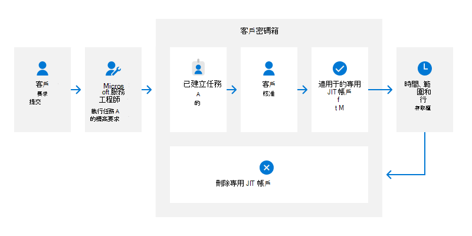

# Microsoft 365 服務工程師存取控制

Zero ZSA Access (的) 表示 Microsoft 服務小組人員沒有任何對 Microsoft 365 實際執行環境或客戶資料的特殊許可權存取權。 當 Microsoft 服務小組成員因任何原因而想要更新服務或存取客戶資料時，他們必須送出要求，以論證授權管理員的需求和接收核准。 在規模上，視需要手動提供和移除存取，以維護 Microsoft 365 服務，如此一來，Microsoft 已開發出自動化的解決方案，以根據需要管理許可權存取。

## Lockbox

所有對 Microsoft 365 系統和客戶資料的存取都是由密碼箱（使用即時 (JIT) 和足夠存取 (JEA) 模型）來進行傳輸，以提供服務工程師對指定之 Microsoft 365 服務和資料的臨時許可權存取。 此外，所有要求和動作都會記錄下來以供審核之用，而且可使用[Office 365 管理活動 API](/office/office-365-management-api/get-started-with-office-365-management-apis)及[安全性與合規性中心](https://protection.office.com/)進行存取。

在 Microsoft service 工程師可以連線至任何 Microsoft 365 系統或存取客戶資料之前，必須透過資料箱提交存取要求。 只有在符合特定準則時，才能核准此要求：

- 服務工程師符合 [服務小群組帳戶的資格需求](assurance-microsoft-365-account-management.md)，
- 它們屬於與要求中的工作相關聯的密碼箱角色。
- 要求的存取時間未超出允許的最大時間，
- 他們有合理的業務理由，
- 他們想要存取的要求資源位於其工作範圍內，而且
- 他們會收到管理員核准

一旦密碼箱符合並驗證所有準則之後，就會授與執行所要求之特定動作的暫時存取權。 在要求的時間過後，便會撤銷存取權。

此外，如果客戶授權並啟用 [客戶密碼箱](/microsoft-365/compliance/customer-lockbox-requests) 功能，Microsoft 服務工程師對客戶資料的任何嘗試，都必須由客戶承租人中的系統管理員進一步核准。 客戶和 Microsoft 都可能會出現存取客戶資料的需求。 例如，客戶所引發的事件可能需要存取其資料以修正問題，或 Microsoft 需要資料存取才能套用特定更新。

客戶沒有任何工具可以啟動客戶加密箱要求;他們必須送出要求提升客戶加密箱要求的票證給 Microsoft。 Microsoft service 工程師所引發的客戶加密箱要求必須由 Microsoft 管理員和客戶租使用者中的授權系統管理員核准。

### 密碼箱角色

若要強制分隔職責和最低許可權的原則，服務工程師必須屬於與其小組角色相對應的密碼箱角色。 在身分識別管理工具內，會管理密碼箱角色，並定義可以透過密碼箱要求處理者核准的服務小組成員的許可權和動作。 服務小組人員必須要求是「密碼箱」角色的成員，並接受管理核准。 若核准，該員工的服務小群組帳戶會放在 Active Directory (AD) 和 Azure Active Directory (AAD) 強制執行的安全性群組中。

## 受限制的管理介面

服務工程師使用兩個管理介面來執行系統管理工作：來自安全訪問工作站的遠端桌面 (透過安全的終端機服務閘道 (TSG) 和遠端 PowerShell，看到) 。 在這些管理介面內，根據已核准之密碼箱要求和軟體原則的存取控制措施，對執行哪些應用程式以及可以使用哪些命令和 Cmdlet 進行重要限制。

## 遠端桌面

使用遠端桌面管理其服務的服務小組成員必須從 Microsoft 專為此使用案例所管理的鋸、專門設計和製造的膝上型電腦進行連線。 與供應商的 Microsoft 合作夥伴若要建立 SAWs，請建立簡短且安全的供應鏈。 SAWs 使用已設定為限制所有功能（定義的管理工作所需的功能除外）的加固作業系統。 這些限制包括停用所有 USB 埠、嚴格的應用程式存取清單、郵件存取的移除、限制 internet 流覽，並強制執行非使用中的螢幕保護裝置程式鎖定。 Microsoft access control systems 會定期檢查所看到的機器，以確保它們符合最新的安全性控制措施，如果決定不相容，便會自動停用電腦。

服務工程師一次只允許連線至一個 TSG，而且不允許多個會話。 不過，TSGs 可讓 Microsoft 365 的服務小組管理員連線至多部伺服器，每個伺服器只具有一個同時會話，所以系統管理員可以有效地執行其職責。 服務小組管理員對 TSGs 本身沒有任何許可權。 TSG 只用于強制執行多重要素驗證 (MFA) 和加密需求。 一旦服務小組管理員透過 TSG 連接至特定伺服器，該特定伺服器會強制每個系統管理員一個會話的會話限制。

Microsoft 365 人員的使用限制、連接及設定需求，都是由 Active Directory 群組原則所建立。 這些原則包括下列 TSG 特性：

- 只使用 [FIPS 140-2](/compliance/regulatory/offering-FIPS-140-2) 驗證的加密
- 在非活動狀態15分鐘後中斷會話連線
- 會話會在24小時後自動登出

連接至 TSGs 也需要使用個別的實體智慧卡進行 MFA。 服務工程師會為各種平臺和機密管理平臺發佈不同的智慧卡，以確保認證的安全儲存。 TSGs 使用 Active Directory 群組原則來控制可登入遠端伺服器的使用者、允許的會話數目及空閒超時設定。

## 遠端 PowerShell

除了使用特別設定之 TSGs 的遠端存取之外，服務小組人員和 Service the Operations 密碼箱角色也可以使用遠端 PowerShell，存取生產伺服器上的特定管理功能。 若要使用此存取，使用者必須獲得唯讀 (調試) 存取 Microsoft 365 實際執行環境的授權。 啟用許可權提升的方式，與使用密碼箱處理常式對 TSGs 啟用許可權提升的方式相同。

針對遠端存取，每個資料中心都有一種負載平衡虛擬 IP，可充當單一存取點。 可用的遠端 PowerShell Cmdlet 是以驗證期間所取得存取宣告中所識別的許可權層級為基礎。 這些 Cmdlet 只會提供使用此方法連線之使用者可存取的唯一管理功能。 Remote PowerShell 會限制工程師可使用的命令範圍，並根據透過密碼箱處理常式授與的存取層級而定。 例如，在 Exchange Online 中，可能會有 Get-Mailbox Cmdlet 可用，但 Set-Mailbox 指令程式則不會有。

## 資源

- [Microsoft 365 中的隔離](assurance-isolation-in-microsoft-365.md)
- [Microsoft 雲端預先篩選](assurance-pre-employment-screening.md)[microsoft cloud 背景檢查](assurance-cloud-background-check.md)
