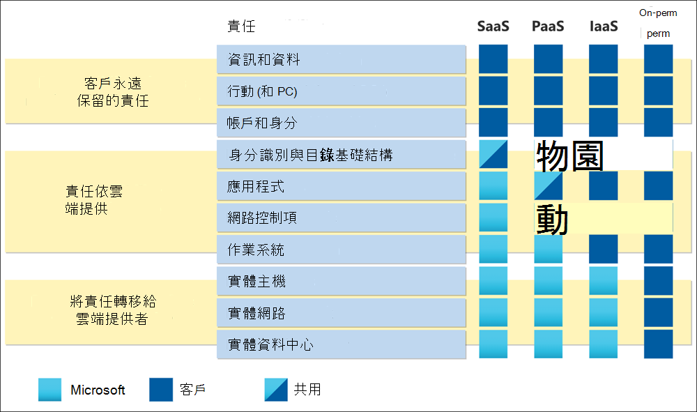

# Microsoft Cloud 的風險評定指南

「雲端風險評估」的目標是確定遷移至雲端的系統和資料，不會將任何新的或不明的風險引入組織中。 其重點是保證資訊處理的機密性、完整性、可用性和隱私權，並使已識別的風險降低低於公認的內部風險閾值。

在共用責任模式中，雲端服務提供者 (CSP) 負責管理 *雲端* 的安全性和合規性（提供者）。 客戶自行負責管理和設定 *雲端中的* 安全性和合規性，依照其需求和風險容限。

在此指南中，您可以瞭解如何有效地評估廠商風險，以及如何使用 Microsoft 提供的資源與工具，分享最佳作法。

## 瞭解雲端中的共用責任

您可以將雲端部署分類為服務 (IaaS) 、平臺為服務 (PaaS) 或軟體作為服務 (SaaS) 。 根據適用的雲端服務模型，在此解決方案的安全性控制層級的責任層級會控制在 CSP 與客戶之間的倒班。 在傳統內部部署模型中，客戶負責整個堆疊。 移至雲端時，會將所有實體安全性責任轉移至 CSP。 根據組織的雲端服務模型，其他責任會轉移到 CSP。 不過，在大部分的服務模式中，您的組織仍然負責存取雲端、網路連線、帳戶和身分識別及資料的裝置。 Microsoft 致力於建立服務，讓客戶能夠跨整個生命週期控制其資料。

Microsoft 雲端的運作方式是超大型，以 DevSecOps 與自動化的組合來標準化運作模型。 Microsoft 作業系統模型變更與傳統內部部署運作模型相比，風險的接近方式，這會導致管理風險的不同和有時候不熟悉的控制項的實施。 當您執行您的雲端風險評估時，請記住 Microsoft 的目標是確定所有風險都已解決，但不一定要執行組織所執行的相同控制。 Microsoft 可使用一組不同的控制措施，以及應反映在雲端風險評估中的風險。 設計及實施強預防性控制措施可減少偵探和修正控制項所需的許多工作。 例如，Microsoft [對零執行的 Access (ZSA) ](assurance-microsoft-365-service-engineer-access-control.md)的實現。

## 採用架構

Microsoft 建議客戶以標準化的方式，將其內部風險和控制架構對應至獨立的架構，以解決雲端風險。 如果您現有的內部風險評估模型並未解決雲端計算所附帶的特定難題，您將會從這些廣泛採用且標準化的架構中受益。 次要優點是 Microsoft 會在檔和工具中提供這些架構對應，以加速風險評估。 這些框架的範例包括 [ISO 27001 Information security standard](/compliance/regulatory/offering-iso-27001)、 [CIS 基準](/compliance/regulatory/offering-cis-benchmark)及 [NIST SP 800-53](https://csrc.nist.gov/Projects/risk-management/sp800-53-controls/release-search#!/800-53)。 Microsoft 提供任何 CSP 的一組最完整的相容性選項。 如需詳細資訊，請參閱 [Microsoft 規範服務](/compliance/regulatory/offering-home)。

使用 [Microsoft 合規性管理員](/microsoft-365/compliance/compliance-manager) 建立您自己的評估，以評估適用于您組織的行業和地區法規的相容性。 評估是以評估範本的架構為基礎，其中包含必要的控制項、改進動作，以及適用的 Microsoft 動作，以完成評估。 針對 Microsoft 動作，提供詳細的執行計畫及最近的審計結果。 如此一來，您可以節省時間，以尋找、對應及研究 Microsoft 如何執行特定的控制項。 如需詳細資訊，請參閱 Microsoft 合規性管理員文章。

## 瞭解 Microsoft 如何運作以保護您的資料

當客戶負責管理和設定 *雲端中* 的安全性和合規性時，CSP 會負責管理 *雲端* 的安全性和合規性。 一種驗證 CSP 是否有效地解決其責任，並 upholding 其承諾的方法，就是複查其外部的審計報告（例如 ISO 和 SOC）。 Microsoft 讓外部審核報告可供 [服務信任入口網站](https://servicetrust.microsoft.com/ViewPage/MSComplianceGuideV3)上的已驗證物件使用。

除了外部審計報告之外，Microsoft 強烈鼓勵客戶利用下列資源，以協助深入瞭解 Microsoft 的運作方式：

- [隨選 Learning 路徑](/learn/roles/auditor)： Microsoft 的學習平臺提供數百種教學途徑和模組的不同主題。 在兩者之間， [深入瞭解 microsoft 如何保護客戶資料](/learn/paths/audit-safeguard-customer-data/) ，以瞭解 microsoft 的基本安全性和隱私權作法。

- [Microsoft 規章上的服務保證](/compliance/#service-assurance)： microsoft 的做法上的文章會分類到16個網域中，以便於複查。 每個網域都包含一個概述，可捕獲 Microsoft 如何管理每個地區相關的風險。 提供審計表時，包含最新報告的連結，這些連結儲存于服務信任入口網站、相關章節，以及針對 Microsoft 線上服務執行審計報告的日期。 若有可用，說明控制執行的偽像連結（例如，協力廠商的漏洞評估和商務持續性計畫驗證報告）。 與審計報告類似的是，這些工件是以 STP 為宿主，而且需要驗證才能存取。

| **網域** |**描述** |
|:---------- |:-------------- |
| [**架構**](assurance-architecture.md) | Microsoft 線上服務的設計，以及擔當其基礎的安全性原則。 |
| [**稽核記錄**](assurance-audit-logging.md) | Microsoft 如何捕獲、處理、儲存及保護使安全性和效能監控成為可能的記錄。 |
| [**資料中心安全性**](assurance-datacenter-security.md) | Microsoft 如何安全地運作資料中心，以提供在全球範圍運作 Microsoft online services 的方法。 |
| [**加密和金鑰管理**](assurance-encryption.md) | 客戶通訊的加密保護，以及雲端中儲存及處理的資料。 |
| [**控管**](assurance-governance.md) | Microsoft 如何建立、發佈、更新及強制實施整個企業的安全性原則，以符合客戶承諾和規範的需求。 |
| [**人力資源**](assurance-human-resources.md) | 在 Microsoft 的整個時間內，篩選和人員的安全管理。 |
| [**身分識別與存取管理**](assurance-identity-and-access-management.md) | 保護 Microsoft 線上服務和客戶資料不會遭到未經授權或惡意存取。 |
| [**事件管理**](assurance-incident-management.md) | Microsoft 用來準備、偵測、回應及通報所有安全性和隱私權事件的處理常式。 |
| [**網路安全性**](assurance-network-security.md) | Microsoft 如何保護其網路界限免受外部攻擊，並管理其內部網路以限制傳播。 |
| [**隱私權**](assurance-privacy.md) | Microsoft 如何處理及保護客戶資料，以保留其資料權利。 |
| [**復原和連續性**](assurance-resiliency-and-continuity.md) | 用來維護服務可用性的程式和技術，並確保商務持續性和復原能力。 |
| [**風險管理**](assurance-risk-management.md) | 用於將整個企業的風險降至最低的身分識別、評估和採取的動作。 |
| [**安全性開發與作業**](assurance-security-development-and-operation.md) | Microsoft 如何確保在其整個生命週期中安全地設計、執行和管理其服務。 |
| [**安全性監視**](assurance-security-monitoring.md) | 記錄的中央分析，以偵測或警示人員的任何未經授權或惡意的活動。 |
| [**供應商管理**](assurance-supplier-management.md) | Microsoft 的畫面及管理協助 Microsoft 線上服務的協力廠商公司的方式。 |
| [**弱點管理**](assurance-vulnerability-management.md) | Microsoft 用來掃描、偵測和處理弱點和惡意程式碼的程式。 |

## 資源

- [Microsoft Cloud 中金融機構的風險評估與規範指南](https://servicetrust.microsoft.com/ViewPage/TrustDocumentsV3?command=Download&downloadType=Document&downloadId=edee9b14-3661-4a16-ba83-c35caf672bd7&tab=7f51cb60-3d6c-11e9-b2af-7bb9f5d2d913&docTab=7f51cb60-3d6c-11e9-b2af-7bb9f5d2d913_FAQ_and_White_Papers)
- [重點風險： Microsoft 的觀點](https://azure.microsoft.com/mediahandler/files/resourcefiles/concentration-risk-perspectives-from-microsoft-/Concentration_Risk_Perspectives_092020.pdf)
- [服務信任入口網站](https://servicetrust.microsoft.com/)
