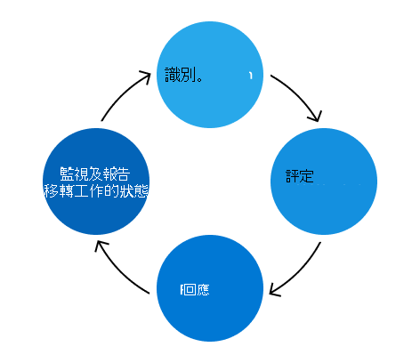

# Microsoft 365風險管理計劃

Microsoft 365 風險管理計劃的目的在於識別、評估和管理 Microsoft 365 風險。 Microsoft 365 的優先順序是符合合約義務和資格鑒定、增加客戶信任，以及維護我們的競爭優勢。 雖然 Microsoft 365 風險管理計劃個別運作，但是會將其與最相符的 Enterprise 風險管理 (ERM) 計畫的原則、優先順序及方法。 使用 ERM 計畫，可在不同的商業單位和工程群組中進行一致的比較，對整個企業中的風險管理造成更為內聚的方法。

Microsoft 365 信任小組負責管理 Microsoft 365 風險管理計劃，並執行 ERM 計畫所展示的活動。 信任小組著重于整合風險管理架構與現有的 Microsoft 365 工程、服務作業及規範程式，讓風險管理計劃更有效率且更有效率。

信任小組也會維護 Microsoft 365 控制架構，這是一組合理化的控制項，在使用支援的合規性活動適當實施時，可讓工程小組遵守重要的規章和認證。 這個架構會隨著風險管理程式的一部分，持續更新，以反映意見反應和結果。

風險管理活動分為四個階段：「識別」、「評估」、「回應」和「監控」和「報告」。

## 識別

風險管理程式開始找出所有可能的風險，以找出 Microsoft 365 環境中的所有主要控制區域、內部和外部威脅及弱點。 此程式的資訊指導來自多個來源，包括採訪、弱點掃描、攻擊類比練習、審核結果和事件管理活動。

信任小組採訪從多個服務小組 (Sme) 的主題專家，以及可能隨著服務成長而引進的潛在未來風險。 此外，Sme 也可協助您驗證從其他連續監控來源識別之風險的準確性和完整性。

識別階段也會檢查決策記錄、作用中的安全性和符合性例外狀況，以及先前風險評估的緩解工作。

## 評估

每個識別的風險都會使用三個計量法評估：影響、可能性及控制缺陷。

- 影響指的是對服務、業務或 Microsoft 所造成的損毀，如果已實現此風險。 對 Microsoft 的影響可能包括對信譽的損毀、客戶損毀，或法律/法規遵從性的影響。
- 可能性會定義已實現潛在風險的可能性，並透過分析其發生的概率及頻率來進行計算。
- 控制缺陷衡量實施的緩解控制措施的效能。

這些計量值是用來計算風險評分，表示每個風險的嚴重性（包括現有的緩解策略）。 會匯總風險並將其呈現給每項服務的重要專案關係人，以驗證 Microsoft 365 風險狀況的準確性和完整性。

## 回應

信任小組使用已驗證的風險清單來 Microsoft 365，將風險指派給受影響的服務，以進行風險回應。 定義的指導方針可協助根據風險分數和控制效能，判斷適當的風險回應策略。 風險回應策略分為四個類別：

- 容許：低風險暴露的區域與低層級的控制措施。
- 運作：低風險暴露的區域，其中控制措施被視為適當。
- 監視：高風險暴露的區域，其中控制措施被視為適當，但應進行監視其有效性。
- 改進：高風險曝光區，具有最低的控制層級，也就是定址的頭等大事。

信任團隊會與服務小組協調，以制定解決每項風險的計畫。 嚴重性層級決定每個計畫的適當檢查和核准層級。 針對需要採取動作的風險，現有的工程程式錯誤處理常式可用於追蹤、管理及作出例外決定。 使用工程和作業團隊所熟悉的程式，可使風險回應更有效率且有效。

## 監視與報告

會監視在風險評估過程中識別的風險，並回報給相關專案關係人。 監視策略包括安全性監控、定期風險檢查、滲透測試及弱點掃描。 這些監控工作是做為報告重要效能指標、建立儀表板及開發正式報告的資料來源，其全部都是對未來風險決策的通知。

一年多次，信任團隊會與每項服務的風險擁有者開會，以查看風險分數、評估其行動計畫的有效性，以及在所需的位置進行更新。 此外，Microsoft 365 的風險評估活動可對 ERM 計畫的 Enterprise 風險評估做貢獻，其可提供 microsoft 高層管理和 ERM 計畫的 microsoft 風險狀態的高層次概述。
