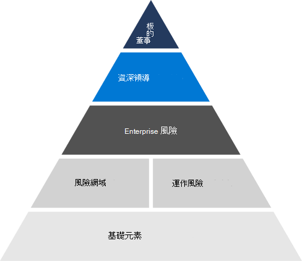

# 風險管理概觀

## Microsoft 如何評估和管理整個企業的風險？

風險管理是針對威脅或可能影響公司或客戶目標的事件，識別、評估及作出回應的程式。 Microsoft 的風險管理旨在預測新的威脅，並為我們的雲端系統及使用這些系統的客戶提供持續的安全性。

Microsoft 的風險管理與 Enterprise 風險管理 (ERM) 架構相符。 ERM 會啟動整體企業風險管理程序，並與企業中的管理作業搭配運作，以識別並確定 Microsoft 最重要風險的責任歸屬。

Microsoft ERM 可啟用整個企業的常見風險管理原則，讓業務單位能夠獨立地協助一致和比較的風險評估。 這種協調讓 Microsoft 能夠以整合的方式來匯總和報告風險資訊以進行管理。 ERM 會為 Microsoft 的業務單位提供風險管理程序常用的方法、工具和目標。 Microsoft 365 及其他工程群組和商務單位使用這些工具，在 ERM 的指導下，以自己的風險管理程式來執行個別的風險評估。

## Microsoft online services 如何搭配 ERM 運作？

每一部線上服務均遵循 ERM 指導方針，以管理各種 Microsoft 服務的風險。 程式重點是將 ERM 架構與現有的 Microsoft 工程、服務作業及規範程式進行協調，使風險管理計劃更有效率且更有效率。 每一項線上服務的風險管理活動最終會匯總到並通知 ERM 處理常式。

在風險評估活動中，每個線上服務都會分析在 Microsoft Controls Framework (Framework) 中所執行之控制項的設計和作業效能。 架構是一組合理化的控制項，可在適當地與支援的合規性活動一起實施時，讓工程小組遵循重要的規章和認證。

## 相關的外部法規 & 認證

Microsoft 的線上服務會定期進行審核，以符合外部法規和認證。 請參閱下表，以驗證與風險管理相關的控制項。

### Azure 和 Dynamics 365

| **外部審計** | **Section** | **最新報告日期** |
|:--------------------|:------------|:-----------------------|
| [ISO 27001/27002](https://servicetrust.microsoft.com/ViewPage/MSComplianceGuideV3?command=Download&downloadType=Document&downloadId=e9116047-f327-430c-a83f-166b7e561ad6&tab=7027ead0-3d6b-11e9-b9e1-290b1eb4cdeb&docTab=7027ead0-3d6b-11e9-b9e1-290b1eb4cdeb_ISO_Reports)    [適用性聲明](https://servicetrust.microsoft.com/ViewPage/MSComplianceGuideV3?command=Download&downloadType=Document&downloadId=00af6c3e-7f3e-4e0d-8b0e-79f45ef2cef1&tab=7027ead0-3d6b-11e9-b9e1-290b1eb4cdeb&docTab=7027ead0-3d6b-11e9-b9e1-290b1eb4cdeb_ISO_Reports)   [認證](https://servicetrust.microsoft.com/ViewPage/MSComplianceGuideV3?command=Download&downloadType=Document&downloadId=d7af5304-3a31-40e6-9abb-e26352305d41&tab=7027ead0-3d6b-11e9-b9e1-290b1eb4cdeb&docTab=7027ead0-3d6b-11e9-b9e1-290b1eb4cdeb_ISO_Reports) | 5：資訊安全性原則 | 2020 年 12 月 2 日 |
| [ISO 27017](https://servicetrust.microsoft.com/ViewPage/MSComplianceGuideV3?command=Download&downloadType=Document&downloadId=e9116047-f327-430c-a83f-166b7e561ad6&tab=7027ead0-3d6b-11e9-b9e1-290b1eb4cdeb&docTab=7027ead0-3d6b-11e9-b9e1-290b1eb4cdeb_ISO_Reports)    [適用性聲明](https://servicetrust.microsoft.com/ViewPage/MSComplianceGuideV3?command=Download&downloadType=Document&downloadId=a3bca0ac-867d-4204-b66b-13665f5f1e8d&tab=7027ead0-3d6b-11e9-b9e1-290b1eb4cdeb&docTab=7027ead0-3d6b-11e9-b9e1-290b1eb4cdeb_ISO_Reports)   [認證](https://servicetrust.microsoft.com/ViewPage/MSComplianceGuideV3?command=Download&downloadType=Document&downloadId=25718a8a-f34d-41e1-a95a-c49246508787&tab=7027ead0-3d6b-11e9-b9e1-290b1eb4cdeb&docTab=7027ead0-3d6b-11e9-b9e1-290b1eb4cdeb_ISO_Reports) | 5：資訊安全性原則 | 2020 年 12 月 2 日 |
| [ISO 27018](https://servicetrust.microsoft.com/ViewPage/MSComplianceGuideV3?command=Download&downloadType=Document&downloadId=e9116047-f327-430c-a83f-166b7e561ad6&tab=7027ead0-3d6b-11e9-b9e1-290b1eb4cdeb&docTab=7027ead0-3d6b-11e9-b9e1-290b1eb4cdeb_ISO_Reports)    [適用性聲明](https://servicetrust.microsoft.com/ViewPage/MSComplianceGuideV3?command=Download&downloadType=Document&downloadId=00af6c3e-7f3e-4e0d-8b0e-79f45ef2cef1&tab=7027ead0-3d6b-11e9-b9e1-290b1eb4cdeb&docTab=7027ead0-3d6b-11e9-b9e1-290b1eb4cdeb_ISO_Reports)   [認證](https://servicetrust.microsoft.com/ViewPage/MSComplianceGuideV3?command=Download&downloadType=Document&downloadId=56904fc3-0942-4ff5-9eef-7cabc751a25c&tab=7027ead0-3d6b-11e9-b9e1-290b1eb4cdeb&docTab=7027ead0-3d6b-11e9-b9e1-290b1eb4cdeb_ISO_Reports) | 5：資訊安全性原則 | 2020 年 12 月 2 日 |
| [ISO 22301](https://servicetrust.microsoft.com/ViewPage/MSComplianceGuideV3?command=Download&downloadType=Document&downloadId=6d388547-fc88-46e3-8de2-6bc2edc08b06&tab=7027ead0-3d6b-11e9-b9e1-290b1eb4cdeb&docTab=7027ead0-3d6b-11e9-b9e1-290b1eb4cdeb_ISO_Reports)     [認證](https://servicetrust.microsoft.com/ViewPage/MSComplianceGuideV3?command=Download&downloadType=Document&downloadId=ee4b611b-bb4d-4056-b189-00da36e88949&tab=7027ead0-3d6b-11e9-b9e1-290b1eb4cdeb&docTab=7027ead0-3d6b-11e9-b9e1-290b1eb4cdeb_ISO_Reports) | 6.1.1：判斷風險和機遇   6.1.2：解決風險和機遇 | 2020 年 3 月 13 日 |
| [SOC 1](https://servicetrust.microsoft.com/ViewPage/MSComplianceGuideV3?command=Download&downloadType=Document&downloadId=b8721ebd-af20-42fe-b22f-8332b0a19517&tab=7027ead0-3d6b-11e9-b9e1-290b1eb4cdeb&docTab=7027ead0-3d6b-11e9-b9e1-290b1eb4cdeb_SOC_%2F_SSAE_16_Reports)   [SOC 2](https://servicetrust.microsoft.com/ViewPage/MSComplianceGuideV3?command=Download&downloadType=Document&downloadId=234a0f57-83c1-4afc-a586-a0e7a59592f7&tab=7027ead0-3d6b-11e9-b9e1-290b1eb4cdeb&docTab=7027ead0-3d6b-11e9-b9e1-290b1eb4cdeb_SOC_%2F_SSAE_16_Reports)   [SOC 3](https://servicetrust.microsoft.com/ViewPage/MSComplianceGuideV3?command=Download&downloadType=Document&downloadId=75c8cbf6-e456-473c-a05e-34fea888ec2a&tab=7027ead0-3d6b-11e9-b9e1-290b1eb4cdeb&docTab=7027ead0-3d6b-11e9-b9e1-290b1eb4cdeb_SOC_%2F_SSAE_16_Reports) | SOC2-26：年度風險評估 | 2021年3月31日 |

### Office 365

| **外部審計** | **Section** | **最新報告日期** |
|:--------------------|:------------|:-----------------------|
| [FedRAMP](https://compliance.microsoft.com/compliancemanager) | CA-2：安全性評估   CA-5：動作和里程碑的計畫   RA-3：風險評估 | 2020年9月24日 |
| [ISO 27001/27002/27017](https://servicetrust.microsoft.com/ViewPage/MSComplianceGuideV3?command=Download&downloadType=Document&downloadId=8d625374-4f2d-49f8-9d37-a4281ba98222&tab=7027ead0-3d6b-11e9-b9e1-290b1eb4cdeb&docTab=7027ead0-3d6b-11e9-b9e1-290b1eb4cdeb_ISO_Reports)    [適用性聲明](https://servicetrust.microsoft.com/ViewPage/MSComplianceGuideV3?command=Download&downloadType=Document&downloadId=c0df4ce8-c77e-4183-84eb-c8688470d8b1&tab=7027ead0-3d6b-11e9-b9e1-290b1eb4cdeb&docTab=7027ead0-3d6b-11e9-b9e1-290b1eb4cdeb_ISO_Reports) | 5：資訊安全性原則 | 2021 年 4 月 20 日 |
| [SOC 1](https://servicetrust.microsoft.com/ViewPage/MSComplianceGuideV3?command=Download&downloadType=Document&downloadId=90df3f9c-3aaf-4dbf-99d0-ca9f2991721b&tab=7027ead0-3d6b-11e9-b9e1-290b1eb4cdeb&docTab=7027ead0-3d6b-11e9-b9e1-290b1eb4cdeb_SOC_%2F_SSAE_16_Reports) | CA-03：風險管理 | 2020月24日 |
| [SOC 2](https://servicetrust.microsoft.com/ViewPage/MSComplianceGuideV3?command=Download&downloadType=Document&downloadId=a73c1738-7892-42b7-acd3-87b6371c53f6&tab=7027ead0-3d6b-11e9-b9e1-290b1eb4cdeb&docTab=7027ead0-3d6b-11e9-b9e1-290b1eb4cdeb_SOC_%2F_SSAE_16_Reports) | CA-02：控管、風險和合規性小組責任   CA-03：風險管理   CA-17： Microsoft 安全性原則   CA-24：內部風險評估 | 2020月24日 |
