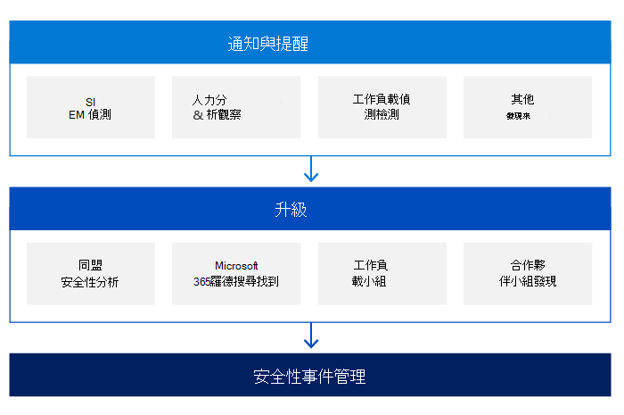

# Microsoft 安全性事件管理：偵測和分析

為了偵測惡意活動，Microsoft 的每一項線上服務都會集中記錄安全性事件及其他資料，並執行各種分析技術，以找出反常或可疑的活動。 記錄檔是透過 Microsoft online services 伺服器和基礎結構裝置收集，並儲存在中央和整合資料庫中。

Microsoft 採取以風險為基礎的方法來偵測惡意活動。 我們使用事件資料和威脅情報來定義偵測並設定其優先順序。

使用具有極高經驗、熟練、熟練之人員的團隊是偵測和分析階段成功的最重要的分項之一。 Microsoft 使用多個服務小組，其中包含具有所有元件之能力的員工，包括在堆疊內的所有元件上，包括網路、路由器、防火牆、負載平衡器、作業系統和應用程式。

Microsoft online services 中的安全性偵測機制也包含不同來源所啟動的通知和警示。 Microsoft 線上服務安全性回應小組是安全性事件升級程式的主要 orchestrators。 這些小組會接收所有升級，並負責分析和確認安全性事件的有效性。

偵測的其中一個主要主要專案是通知：

- 每個服務小組負責根據線上服務安全性小組的需求，記錄服務中的任何動作或事件。 由不同服務小組所建立的所有記錄，都是由安全性資訊和事件管理 (SIEM) 解決方案搭配預先定義的安全性和偵測規則處理。 這些規則會根據安全性小組的建議演變，針對先前的安全性事件所獲知的資訊，判斷是否有任何可疑或惡意的活動。
- 如果客戶決定安全性事件正在進行中，則他們可能會開啟 Microsoft 的支援案例，該支援案例會指派給 Microsoft 通訊小組，並將其轉換為所有適當的小組。

Azure、Dynamics 365 及 Microsoft 365 服務小組也會使用透過安全性監控和登入在趨勢分析中取得的情報，以偵測可能表示攻擊或安全性事件的 Microsoft 線上服務資訊系統中的 abnormalities。 在實際執行環境中，Microsoft 線上服務系統會將這些記錄的輸出匯總到集中式記錄伺服器。 在這些集中式記錄伺服器中，會在整個實際執行環境中檢查記錄的位置趨勢。 集中式伺服器中匯總的資料會安全地傳送至記錄服務，以進行高級查詢、儀表板建立及偵測反常和惡意活動。 服務也會使用機器學習來偵測記錄輸出的異常情況。

在升級期間內，根據安全性事件的性質，安全性回應小組可能會與 Microsoft 的不同小組的一或多個主題專家打交道：

- 線上服務安全性與合規性小組
- Microsoft 威脅情報中心 (MSTIC) 
- Microsoft 安全性回應中心 (MSRC) 
- 公司、外部及法律事務 (CELA) 
- Azure 安全性
- Microsoft 365 工程及其他。

在升級任何安全性回應小組之前，服務小組負責根據定義的準則決定及設定安全性事件的嚴重性層級，例如：

- 隱私權
- 影響
- 範圍
- 受影響的承租人數目
- 區域
- 服務
- 事件的詳細資料
- 特定客戶行業或市場規定。

事件優先順序取決於使用不同的因素，包括但不限於事件的功能影響、事件的資訊影響，以及事件的可復原性。

在收到有關安全性事件的上報後，安全性小組會將虛擬小組組織 (v 小組) 由 Microsoft online 服務安全性回應小組、服務小組和事件通訊小組成員組成。 然後，v 小組必須確認安全性事件的合法性，並消除任何誤報。 在準備階段確定的指示器所提供資訊的準確性是很重要的。 透過依向量攻擊類別來分析此資訊，「五團隊」可以判斷安全性事件是否為合理考慮。

在調查開始時，安全性事件回應小組會依照案例管理原則記錄事件的所有相關資訊。 隨著案例的進展，我們追蹤進行中的動作，並遵循證據處理標準，以在整個事件週期內收集、保留及保護此資料。

這些動作的一些範例包括：

- 摘要，這是事件及其潛在影響的簡短描述
- 事件的嚴重性和優先順序，它們是透過評估潛在影響來衍生
- 所有識別出導致事件發生的標記的清單
- 任何相關事件的清單
- 由 v 小組採取的所有動作清單
- 任何收集的證據，也會保留以供檢討後分析和未來的鑒證調查。
- 建議的後續步驟和動作

在安全性事件確認之後，安全性回應小組和適當服務小組的主要目標是包含攻擊、保護服務 () 受到攻擊，以及避免全域影響較大。 在同一時間，適當的工程小組會運作，以判斷根本原因，並準備第一個復原計畫。

在下一個階段中，安全性回應小組會識別由安全性事件（如果有的話）所影響的客戶 (s) 。 影響範圍可能需要一些時間，以根據地區、資料中心、服務、伺服器陣列、伺服器等來判斷。 受影響客戶的清單是由服務小組和對應的 Microsoft 通訊小組所編譯，然後負責處理合約和合規性義務中的客戶通知程式。

## 相關文章

- [Microsoft 安全性事件管理](assurance-security-incident-management.md)
- [Microsoft 安全性事件管理：準備](assurance-sim-preparation.md)
- [Microsoft 安全性事件管理：包容、eradication 及恢復](assurance-sim-containment-eradication-recovery.md)
- [Microsoft 安全性事件管理：事件後活動](assurance-sim-post-incident-activity.md)
- [如何記錄安全性事件支援票證](/azure/security/fundamentals/event-support-ticket)
- [GDPR 規定的 Azure 和 Dynamics 365 外洩通知](/compliance/regulatory/gdpr-breach-azure-dynamics)
