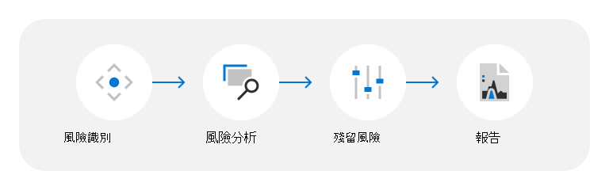

# 資料中心威脅、弱點和風險評估

Microsoft 在24x7x365 為客戶提供超過200的雲服務。 有些範例是諸如 Microsoft Azure、Microsoft Office 365、Microsoft Dynamics 及消費者服務（如 Bing、MSN、Outlook .com、Skype 和 Xbox Live）等企業服務。 這些服務主控于 Microsoft 的雲端基礎結構中：全域分散式資料中心、edge 計算節點和服務運作中心，以及世界最大的全域網路之一;以廣泛的纖維等方式連接所有的記憶體。 由於在1989中開啟第一個資料中心，Microsoft 已在我們的基礎結構中投資數十億美元，繼續致力於提供可靠、可伸縮且安全性增強的線上服務，同時隨著服務成長而有效地管理作業和成本。

Microsoft 雲端服務是以信任和安全性的基礎來建立，優先順序重點在於使用最先進的技術、程式和加密來保護雲端中的客戶資料和應用程式。 客戶資料儲存在 Microsoft 資料中心，而這些資料中心是以深度邏輯和實體安全性措施的各層級進行分散及保護。 Microsoft 資料中心的設計及運作方式是為了保護服務和資料，避免因自然災難、環境威脅或未經授權的存取而損害。

## 威脅、弱點和風險評估方法

威脅、弱點和風險評估 (TVRA) 計畫，可協助您瞭解 Microsoft 如何識別及緩解 Microsoft 資料中心的實體和環境威脅影響。 Microsoft 致力於不斷更新其風險評估和方法，以進行改進，以及隨著條件變更。 因此，TVRA 分析和結論可能會變更，而且報告會被視為時間點。

Microsoft 可協助 TVRA 程式遵循下列步驟：

### 風險識別

Tvra 會考慮從自然和人工所建立的 (（包括意外) 危險）產生的各種各樣威脅案例。 結果會因資料中心位置、設計、服務範圍及其他因素而有所不同。 TVRA 會根據客戶的需求，選取要在 TVRA 檔中醒目提示的威脅案例，以及協力廠商和第一方的風險資訊所提供之風險環境的獨立國家、城市及網站層級評估。 在具有多個資料中心的地區中，會匯總 TVRA 分級，以確保所評估位置的實際和環境威脅、弱點和風險的整體觀點。

針對資料中心 TVRA 評估的威脅案例類型包括：

- **外部威脅**：由外部故意或意外的人工活動所產生的事件。 例如，民用 disorder、恐怖活動、外部盜竊、improvised 爆炸性裝置、進入的攻擊、arson、未經授權的進入和飛機的崩潰。
- **內部威脅**：由內部蓄意或意外的人工活動所產生的事件。 例如內部盜竊和破壞。
- **自然危險**：可能會對資料中心造成負面影響的自然處理或現象。 例如，tropical 風暴、cyclones、洪水、landslides、drought、wildfire、地震、volcanic 活動，以及具有閃電、hail、強 winds 或繁重 rain 的嚴重風暴。
- **環境威脅**：可能對資料中心造成負面影響的環境條件。 例如，水壓力、熱應力和瘟疫。

### 風險分析

威脅是根據其固有風險的評估來評估;在缺少管理動作和控制措施時，會將固有的風險當做威脅和威脅發生之固有影響的功能計算。 這兩項評估都是由內部主題專家 (SME) 意見反應和使用外部風險指數所獲悉。

### 殘留風險

在考慮控制效能後，會決定剩餘風險等級的衡量。 控制效能是評估目前管理動作的衡量，也就是設計用來防止或偵測威脅的方式，同時評估控制項將會有其所需效果的方式，設計及實施。 透過彙總 TVRA 中資料中心位置之控制措施有效性的內部 SME 意見反應，來取得這些評估。

### 報告

完成評估之後，就會產生 TVRA 報告以進行管理核准，並支援與風險管理相關的整體工作。

## 資源

- [Azure 全域基礎結構](https://www.microsoft.com/datacenters)
